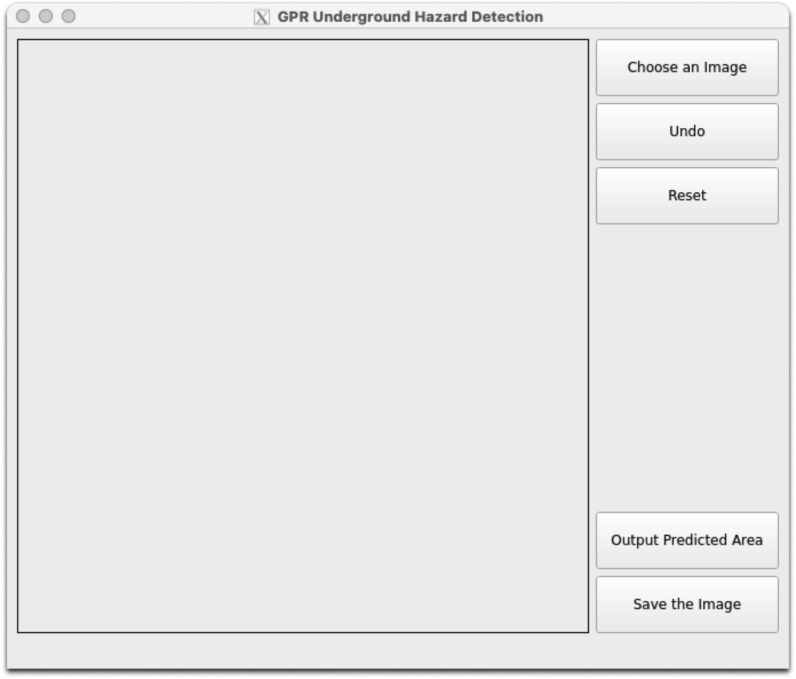
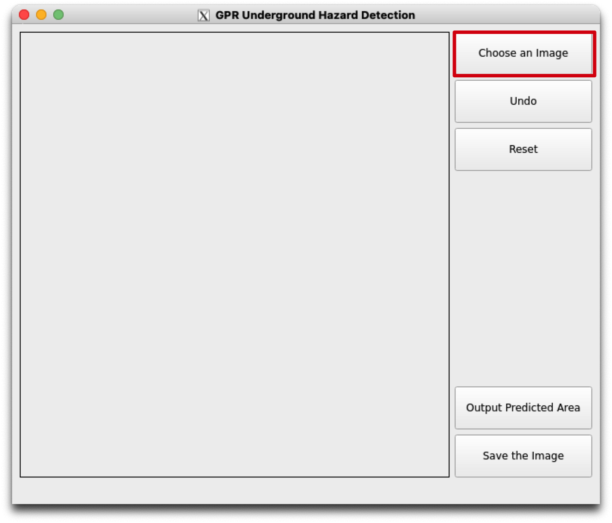
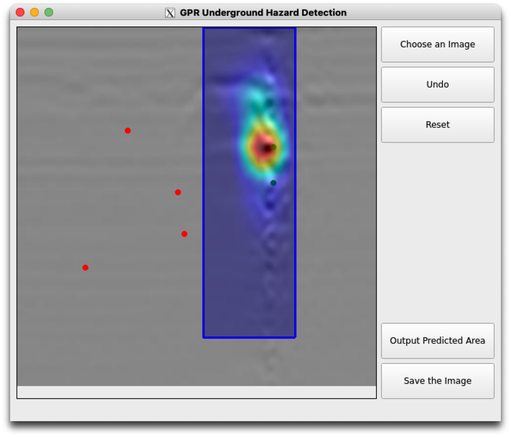
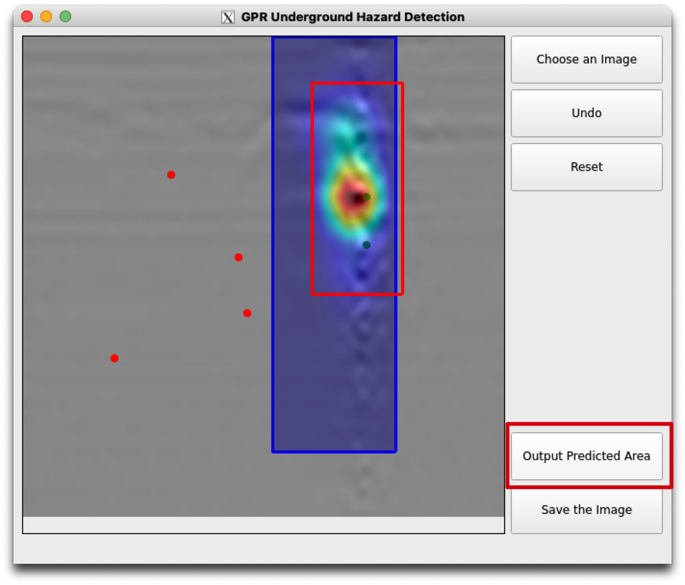
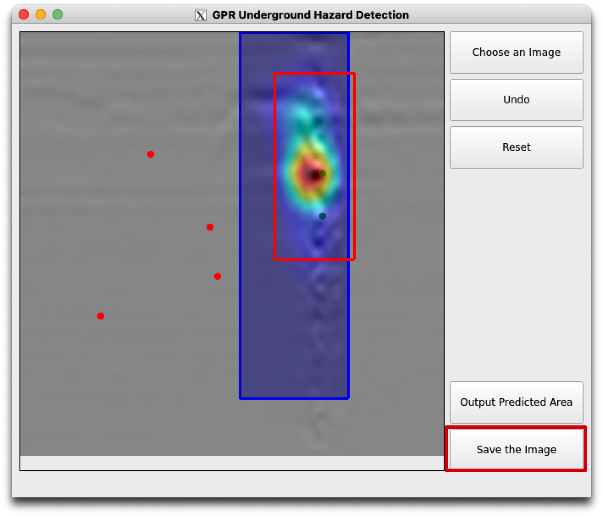
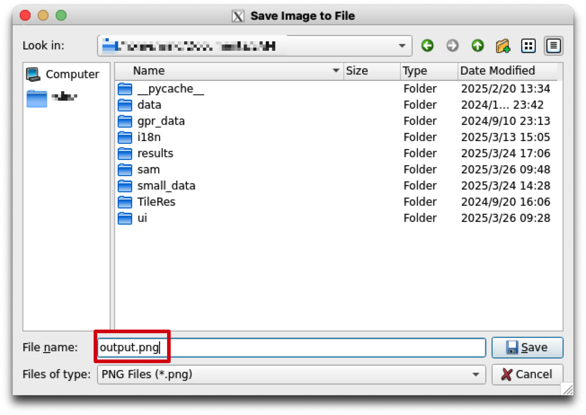

# Res-SAM Framework for GPR Underground Hazard Detection

Res-SAM adopts a **two-stage processing workflow** to efficiently detect underground hazards and structures. First, the **Segment Anything Model (SAM)** preprocesses the GPR images, rapidly marking potential anomaly candidate regions without additional training. Then, **Reservoir Computing (RC)** is used to calculate the anomaly score heatmap. By integrating **Dual-Directional Echo State Networks (2D-ESN) and image patching techniques**, the software refines the anomalies within the candidate regions with high precision.

This software can detect **underground risks** such as **cavities, cracks, and loose regions**, as well as **man-made structures** like **pipes and manholes** (which are not considered risks but still valuable for detection). The anomaly score heatmap highlights high-risk areas for further analysis.


# Res-SAM Framework Overview

Detecting underground anomalies using GPR faces three significant challenges. First, anomaly involves unknowns, thus, there is a notable shortage of labeled anomaly data. Acquiring anomaly samples is costly, resulting in highly imbalanced datasets dominated by normal (non-target) samples. This imbalance severely restricts the training process of data-driven approaches. Second, the high variability of subsurface environments, including diverse soils and structures, leads to significant differences in EM wave characteristics. Such variability impedes the generalization capability, causing approaches trained on one scenario to likely perform poorly in others. Third, underground anomalies typically present as gradual changes in EM wave reflections rather than sharp, distinct boundaries. This gradual transition complicates precise anomaly localization, making conventional methods designed for visual images inadequate for wholly and accurately delineating anomaly boundaries in real-world applications.


Res-SAM leverages minimal non-target training data, readily obtainable from the detection area, and avoids computationally intensive training, enabling rapid deployment in unexplored environments. It synergizes visual discernibility with local dynamic variations in GPR data caused by underground anomalies. Recognizing that practical subsurface anomaly detection necessitates clearly delineating entire affected regions, Res-SAM provides rectangular outlines of anomalies along with their categorization. As depicted in the figure, Res-SAM operates in two main phases: "Feature Collection" and "Anomaly Detection". 

In the Feature Collection phase, local patches are extracted from non-target GPR data and fitted individually using the Dual-Directional Echo State Network (2D-ESN). Acknowledging the vertical continuity of EM waves and horizontal correlations due to the consistency of the subsurface medium, effective changing information exists both vertically and horizontally within GPR data. 2D-ESN, a Reservoir Computing Network that incorporates two reservoirs in its hidden layer, connects each data point within the patch to its neighbors in both vertical and horizontal directions. Fitting each patch with 2D-ESN adequately captures the local data-inherent dual-directional changing information, resulting in a compact fitted readout model serving as "dual-directional dynamic features"
of the original patch. These features, derived from patches on non-target data and denoted as "normal features", collectively represent local changing information in non-target data and are stored in a "Feature Bank".

In the Anomaly Detection phase, SAM is first introduced to identify initial candidate anomaly regions, guided by simple click prompts. However, anomalies in GPR data often have indistinct boundaries due to EM wave reflection, diffraction, and attenuation, necessitating further refinement. To this end, we focus on local changing information within GPR data caused by underground anomalies, aiming to precisely adjust the candidate region. Specifically, for each point within the candidate region, we extract a local patch centered on this point and fit this patch using 2D-ESN. The obtained dynamic features are compared with the normal features in the feature bank. Patches exhibiting significantly different dynamics (or features) indicate high anomaly likelihood; overlapping anomaly patches are then merged to precisely delineate anomaly regions. Owing to the similar changing information in GPR data, similar subsurface structures result in comparable dynamic features, while those from different structures exhibit significant variances, reflecting their distinct changing information along and among EM waves. Therefore, the confirmed anomaly regions undergo another round of 2D-ESN fitting to derive category-specific dynamic features, enabling anomaly categorization.


# Guidance Video for Res-SAM

https://github.com/user-attachments/assets/2507d121-58e2-421e-9972-6af967462a31

# System Requirements

To ensure smooth operation, the following system specifications are recommended:

- **Operating System**: Linux (Ubuntu 20.04+), Windows 10/11
- **Python Version**: 3.8 or higher
- **GPU Support**: NVIDIA GPU, CUDA 12.4+ recommended for acceleration
- **Memory Requirements**: 16GB RAM or more recommended

# Installation Guide

1. Clone the project repository:

```bash
git clone https://github.com/your-repo/GPR-Subsurface-Anomaly-Detection.git
cd GPR-Subsurface-Anomaly-Detection
```

2. Create a virtual environment:

```bash
python -m venv venv
source venv/bin/activate  # Linux/macOS
# venv\Scripts\activate  # Windows
```

3. Install dependencies:

```bash
pip install -r requirements.txt
```

- [PyTorch](https://pytorch.org/)

Please visit the official PyTorch website and follow the instructions to install PyTorch with the appropriate CUDA version for your system.

- [Faiss](https://github.com/facebookresearch/faiss)

```bash
conda install pytorch::faiss-cpu
```
or
```bash
conda install pytorch::faiss-gpu
```

- [Segment Anything](https://github.com/facebookresearch/segment-anything)

The package is included in requirements.txt already. Additionally, Segment Anything requires downloading the pre-trained model weights: [ViT-L SAM model](https://dl.fbaipublicfiles.com/segment_anything/sam_vit_l_0b3195.pth),
which should be placed in the `sam` directory of the project.

# Usage

## Running the Software

Simply run the following command:

```bash
python main.py
```

To switch to the Chinese version, modify the `os.environ['LANGUAGE']` variable in `main.py`:

```python
os.environ['LANGUAGE'] = 'zh-CN'
```


Then, execute the command again:

```bash
python main.py
```


## Software Interface & Operations



1. Select an Image
Click the "Choose an Image" button to load an image from your local storage.



2. Mark Areas of Interest
    - Left-click to mark green points, indicating areas of interest (potential anomaly regions).
    - Right-click to mark red points, indicating non-anomalous areas.
    - The SAM model will use these marked points to draw a blue bounding box around the suspected anomaly.
    - The software will then generate an anomaly score heatmap within this area to visualize risk levels.
    - This step can be repeated multiple times for adjustment.



3. Output Predicted Area

Click "Output Predicted Area" to refine the anomaly regions based on the heatmap. A new red bounding box will be generated.



4. Save Processed Image

Once satisfied with the adjustments, click "Save the Image" to save the processed image locally.





5. Output Image

The saved image includes the processed visualization.


# Data Input & Output

- Input: The software supports PNG and JPEG formats for GPR radar images.

- Output: The processed results can be saved in PNG and JPEG formats.

# Core Modules & API

- `sam/sam.py`: Integrates operations related to the Segment Anything Model (SAM).
    - `predict`: Generates the highest-confidence object mask.
    - `find_box`: Computes the bounding box corresponding to the mask.

- `PatchRes` Module: The core functionality module of the software
    - Computes and visualizes anomaly score heatmaps.
    - Optimizes bounding boxes for detected anomalies.

- `ui` Module: Implements the Graphical User Interface (GUI) to enhance usability.

- `i18n` Module: Provides multi-language translation support.

# 📄 License

This project is licensed under the **GNU General Public License v3.0** - see the [LICENSE](LICENSE) file for details.
